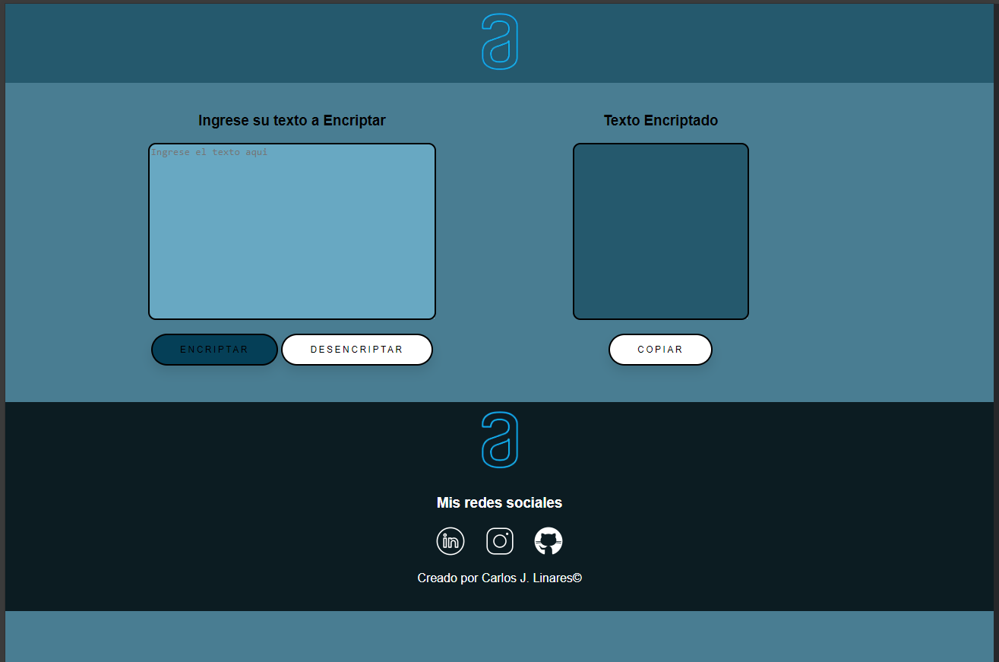

# Encriptar Alura

Este proyecto consiste en una página web que permite a los usuarios encriptar y desencriptar texto utilizando un algoritmo personalizado. 

## Captura de Pantalla

## Descripción

La página web consta de dos secciones principales: una sección donde los usuarios pueden ingresar texto para encriptar, y otra sección donde se muestra el texto encriptado. Además, se proporciona un botón para copiar el texto encriptado al portapapeles. El algoritmo de encriptado reemplaza ciertas letras del texto ingresado por otras letras, y el desencriptado realiza el proceso inverso.

## Tecnologías Utilizadas

- HTML5
- CSS3
- JavaScript

## Uso

1. Ingresa el texto que deseas encriptar en el campo de texto.
2. Haz clic en el botón "Encriptar" para generar el texto encriptado.
3. Si deseas revertir el proceso, haz clic en el botón "Desencriptar".
4. Puedes copiar el texto encriptado haciendo clic en el botón "Copiar".

## Autor

- [Carlos Linares](https://github.com/KarlangaXZ)

## Licencia

Este proyecto está bajo la Licencia [MIT](LICENSE).
